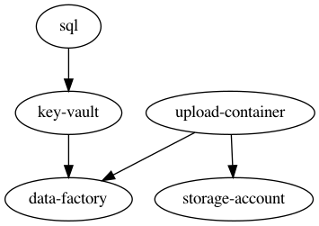
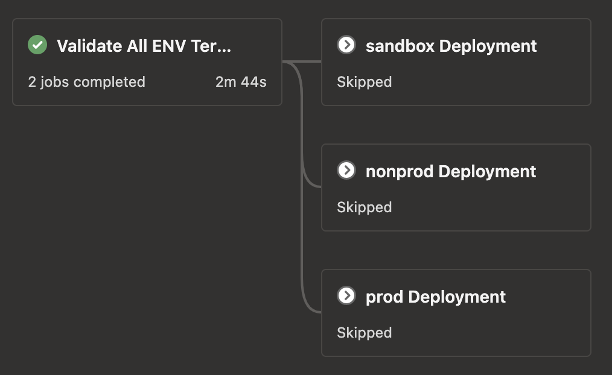

# data-factory-poc-live

POC2 consisted of Infrastructure as Code _(IaC)_ to set up an [Azure Data Factory](https://docs.microsoft.com/en-us/azure/data-factory/). The
[Terraform](https://terraform.io) modules are stored in the `data-factory-poc-modules` repo. This repository contains the
[Terragrunt](https://terragrunt.gruntwork.io/) and [Azure Pipelines](https://azure.microsoft.com/en-us/services/devops/pipelines/) automation to
deploy the modules in an orchestrated and repeatable way.

## Process

The process in this repo has two main parts: Terragrunt and Azure Pipelines.

### Terragrunt

The Terragrunt structure will be as follows:

```bash
├── common_vars.yaml
├── nonprod
├── prod # not in this POC but here for example
├── sandbox
│   ├── data-factory
│   │   └── terragrunt.hcl
│   ├── key-vault
│   │   └── terragrunt.hcl
│   ├── sql
│   │   └── terragrunt.hcl
│   ├── storage-account
│   │   └── terragrunt.hcl
│   ├── subscription.hcl
│   └── upload-container
│       └── terragrunt.hcl
└── terragrunt.hcl
```

Some things to note:

* Each environment will have the same structure
  * We only have `sandbox` explicitly broken down in the directory structure above
  * `prod`, `nonprod`, and any other environment (i.e. CRT) will have the same structure
* `common_vars.yaml` will contain values that are used globally through this process
* Each directory in the `sandbox` directory is related to a Terraform module created in another repository.
  * each has a `terragrunt.hcl` file that contains module specific [inputs](https://terragrunt.gruntwork.io/docs/features/inputs/)
  * For example, the `terragrunt.hcl` in the `data-factory` directory will contain inputs like `vsts_config` which is specific to that module
  * Each Terragrunt configuration file can specify dependency Terragrunt stages -- other modules -- that need to be run.
    * For example, the `key-vault` module Terragrunt specifies `data-factory` as a dependency like so
      ```
      dependency "data_factory" {
        config_path  = "../data-factory"
      }
      ```
    * The dependencies can be displayed using the Terragrunt command `terragrunt graph-dependencies | dot -Tsvg > graph.svg` assuming you have [GraphViz](https://graphviz.org/) installed. Example below

    

### Pipeline

This pipeline has two main features: validate and apply. The pipeline file is the `azure-pipelines.yaml` file. Liatrio recommends using this method
of storing your Pipeline as Code. The pipelines file contains multiple stages as seen in the image below:



#### Validate

The validate stage is ran in every branch and validates the Terragrunt in every environment. This makes sure that the Terragrunt configuration is
syntactically correct before you attempt to deploy to an environment. Each environment is validated using a
[templated job](https://docs.microsoft.com/en-us/azure/devops/pipelines/process/templates?view=azure-devops#job-reuse).
See `pipeline_templates/validate-terragrunt.yaml` for implentation details.

#### Apply

The [`terragrunt apply-all`](https://terragrunt.gruntwork.io/docs/features/execute-terraform-commands-on-multiple-modules-at-once/#the-apply-all-destroy-all-output-all-and-plan-all-commands)
is being used to apply all of the needed modules. This command has been encapsulated in a
[stage template](https://docs.microsoft.com/en-us/azure/devops/pipelines/process/templates?view=azure-devops#stage-reuse) in the
`pipeline_templates/apply-terragrunt.yaml` file. There is a [condition](https://docs.microsoft.com/en-us/azure/devops/pipelines/process/conditions) on
each stage will be evaluated for all branches. The stage will only continue to run if the branch being operated on matches the branch in the template
parameters.

This apply template has 2 important notes:

1. This pipeline uses a [Deployment Job](https://docs.microsoft.com/en-us/azure/devops/pipelines/process/deployment-jobs) in Azure pipelines. This allows the use of [environments](https://docs.microsoft.com/en-us/azure/devops/pipelines/process/environments).
2. The job contains the authentication prep for Terragrunt. Without this, Terragrunt could reach out to the modules repository.

#### Automatic PR Creation for higher environments

The pipeline will open PRs in order to facilitate easier promotion and mitigate human error. This automation is run as a separate job in the `apply`
stage when
* The pipeline is run on an environment branch
* The current environment branch isn't the final environment

This solution uses the Azure CLI with the Azure DevOps Extension. It runs the `az repos pr create` command and passes in information from a variable group.

_Note: This is happy-path automation. There are some edge cases where this POC automation needs to be built out a bit. e.g. when there is already a
PR created -- this would cause a failure today but can be handled with more AZ CLI/Pipeline work_

## Requirements

* Azure DevOps Container
  * [Go](https://golang.org/doc/install)
  * [Terraform](https://terraform.io)
  * [Terragrunt](https://terragrunt.gruntwork.io/)
* Azure DevOps with Pipelines and Deployment Job capabilities
* Azure CLI with [Azure DevOps Extension](https://docs.microsoft.com/en-us/azure/devops/cli/)
